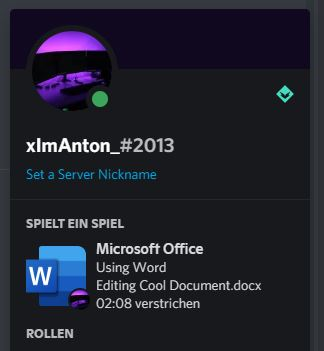

# Microsoft Office Discord Rich Presence
A small Program which shows your Microsoft Office Activity in your Discord Status.

## Disclaimer
I tested this on my PC using Windows 10 and Office 2013, so I can't guarantee it will work on other Systems or with other MS Office Versions.

If it's not working for you, open an Issue.

## Features
At the moment this supports only Word and Excel, other programs will follow.
This is by far only a program that runs infinitely in the background.
I will later add a system tray notification icon for controlling the shown information and closing the program.

This is how it looks like.

## How it works
The program is just searching all open windows for word or excel windows.
This is done via the WinAPI.
When a windows is found,
the document title is extracted from the window title of a child window of the main word window,
because this title only contains the document title, so we don't have to extract the document name from the main window's title.
This method doesn't work for PowerPoint or Publisher windows, so maybe I have to find another method to get the document name for them.
I did the reverse-engineering with the Spy++ Tool of VisualStudio.
